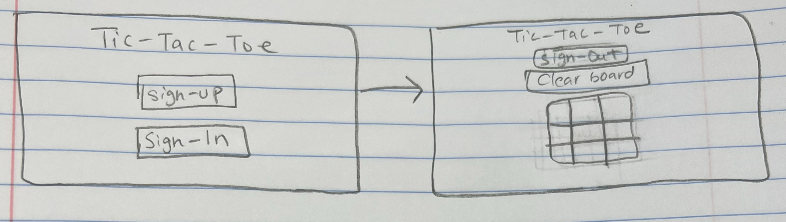

# Tic Tac Toe

## Objective:

* Build a tic tac toe game with user authentication using HTML, CSS, JavaScript, and jQuery 

You can see the deployed game [here](https://steph-kimm.github.io/auth-tic-tac-toe/).

This game was used as practice with user authentication. 
To play I drew a simple wireframe which can be seen below.

# Authentication features 

* User can create an account
* User can login and logout
* User can only play when logged in

# Game Features

* Fields start empty and are filled one by one 
* Once a box is chosen it cannot be removed or changed (until next game)
* "Clear Board" button is available if you want to restart the game

